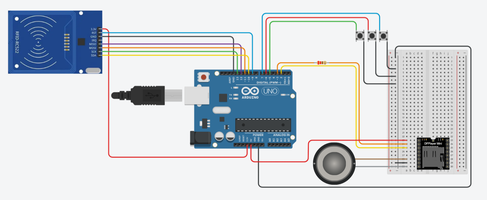

# Agentes do Conhecimento

### Jogo de tabuleiro voltado para crianças com alguma deficiência visual e crianças videntes também, desenvolvido pelo Grupo 7 na disciplina de Projeto 1, do primeiro período na Cesar School.

---
Um jogo de tabuleiro, pensado para ser jogado com mãos, ouvidos e corpo, com foco em engajar e incluir pessoas que enxergam bem ou não, que convida os jogadores a interagir com saberes por meio de experiências táteis, sonoras e digitais. O uso de texturas, formas em relevo e estímulos auditivos permite que o jogo seja compreendido e jogado por pessoas com pouca ou nenhuma visão, incentivando o convívio, a diversão e o aprendizado junto aos demais colegas.

## 🤖 Preparando o Arduino


### 🧰 Componentes eletrônicos:

- Arduino Uno R3;
- DFPlayer Mini (Módulo mp3);
- Caixa de som, para saída de áudio;
- Cartão Micro SD (até 32GB de armazenamento e formatado em FAT32 ou FAT16);
- Leitor RFID MFRC522;
- 4 Cartões RFID;
- Protoboard de 830 pinos;
- 1 Resistor 220Ω;
- 7 Jumpers macho-fêmea;
- 12 Jumpers macho-macho;
- 3 botões PBS-29.

### ♟ Tabuleiro e Estrutura Física:

- 1 base de MDF (servindo como corpo do tabuleiro);
- 2 trilhas em MDF;
- 1 suporte para aproximação de carta em MDF;
- 1 base para fim da trilha em MDF;
- 2 peões de jogador;
- Cola 3D;
- Tintas: branca, preta, azul, verde e vermelha.

### 🔊 Arquivos de áudio
Utilize o cartão Micro SD especificado para armazenar as pastas numeradas (localizadas no pasta compactada "arquivos_de_audio.zip"). Insira o cartão Micro SD no DFPlayer Mini, enquanto ele estiver desligado.<br>
**Observação**: Você pode consultar a organização das perguntas, correções e efeitos sonoros, que estão numerados, no documento de texto ["organizacao_de_perguntas.txt"](organizacao_de_perguntas.txt).

### 🔌 Montagem do circuito
Reproduza o circuito apresentado no esquemático a seguir.



---

## 🏗 Preparando para o código
### 🛠 Instalação do Arduino IDE

<a href= "https://www.arduino.cc/en/software/">Clique aqui para instalar</a>

### 📚 Bibliotecas Necessárias

Para o funcionamento do código, são necessárias as seguintes bibliotecas. As que precisam ser instaladas estão listadas abaixo, enquanto outras já vêm inclusas no Arduino IDE.

#### Bibliotecas a Instalar:
* **DFRobotDFPlayerMini:** Essencial para controlar o módulo de áudio DFPlayer Mini. Facilita a reprodução de arquivos de áudio (MP3, WAV) de um cartão microSD.
* **MFRC522:** Permite a interação com o módulo leitor de RFID MFRC522, possibilitando a leitura de tags RFID.

**Instalação de bibliotecas:**
Com o Arduino IDE aberto, clique no ícone dos livros (Gerenciador de Bibliotecas). Na barra de pesquisa, digite o nome das bibliotecas listadas acima e realize a instalação.

#### Bibliotecas Inclusas por Padrão:
* **SoftwareSerial:** Usada para criar portas seriais "virtuais" em qualquer pino digital do Arduino, permitindo comunicação com dispositivos seriais adicionais.
* **SPI (Serial Peripheral Interface):** Fundamental para a comunicação entre o Arduino e dispositivos que utilizam o protocolo SPI, como o leitor RFID e o cartão SD do DFPlayer Mini.

---

## 💻 Utilização do código

### Aplicação do código
Realize o download no arquivo "main.ino", localizado nesse repositório, e abra-o com o Arduino IDE.

### Bibliotecas

```c++
// Incluindo bibliotecas
#include <SoftwareSerial.h>
#include <DFRobotDFPlayerMini.h>

#include <SPI.h>
#include <MFRC522.h>
```

### Declaração de variáveis importantes

```c++
const int pin_btn1 = 5;
const int pin_btn2 = 6;
const int pin_btn3 = 7;

bool btn1State;
bool btn2State;
bool btn3State;

int pergunta_dada = 0;
int resposta = 0;
int questao;

unsigned long marcador;
unsigned long demora;

int pergunta = 1;
int pasta = 1;
```
#### Essas variáveis são usadas para controlar o estado dos botões, gerenciar o fluxo do jogo (qual pergunta está ativa, se há uma resposta pendente), e para cronometrar eventos.

### Configuração do programa

```c++
void setup() {
    pinMode(pin_btn1, INPUT_PULLUP);
    pinMode(pin_btn2, INPUT_PULLUP);
    pinMode(pin_btn3, INPUT_PULLUP);
  
    mySoftwareSerial.begin(9600);
    Serial.begin(115200);

    if (!myDFPlayer.begin(mySoftwareSerial)) {
        Serial.println(F("Erro ao iniciar DFPlayer"));
        while (true);
    }
    myDFPlayer.volume(30);
    myDFPlayer.EQ(0);
    Serial.println(F("DFPlayer pronto"));

    SPI.begin();              // Inicia comunicação SPI
    rfid.PCD_Init();          // Inicia o sensor RFID
    Serial.println("Aproxime a tag do leitor...");
}
```
#### A função ```setup()``` prepara todos os componentes essenciais, nesse caso os botões, comunicação serial, DFPlayer e módulo RFID para que o programa principal possa interagir com eles.

### Leitura dos cartões RFID

```c++
if (!rfid.PICC_IsNewCardPresent()) return;
if (!rfid.PICC_ReadCardSerial()) return;

// Para a leitura
rfid.PICC_HaltA();

if (rfid.uid.uidByte[0] == x) {
    Serial.println("É x!");
    pasta = y;
    questao = random(1, z);
    pergunta = questao;

    myDFPlayer.playFolder(pasta, pergunta);
    
    Serial.print(pasta);
    Serial.print(", ");
    Serial.println(questao);
    pergunta_dada = 1;
    //Marcar tempo
    marcador = millis();
    delay(1000);
}
```
- No código completo, x, y e z representam valores específicos que são definidos em outra parte do programa para controle das pastas de áudio e quantidade de perguntas.
- O código lê o cartão e verifica a área de conhecimento associada a ele. Essa área de conhecimento corresponde à pasta "y" no sistema de arquivos. A seleção da pasta é feita com base no primeiro byte do UID (Identificador Único) do cartão, que, neste exemplo, é "x". A variável "z" representa a quantidade de perguntas que essa área de conhecimento específica possui, mais um;
- Reproduz o arquivo de áudio relacionado a pergunta;
- Registra que a pergunta foi enunciada;
- Iniicia a cronometragem do tempo entre a pergunta e a resposta.

### Pressionando botões

```c++
//Ler botão pressionado
btn1State = digitalRead(pin_btn1);
btn2State = digitalRead(pin_btn2);
btn3State = digitalRead(pin_btn3);

// Se pressionar o botão de repetição
if (btn3State == LOW && pergunta_dada == 1) {
    myDFPlayer.playFolder(pasta, pergunta);
    delay(2000);
}
  
  // Se pressionar algum dos botões de resposta
if (btn1State == LOW && resposta == 0 && pergunta_dada == 1) {
    Serial.println("V");
    resposta = 1;
    delay(1000);
}
else if (btn2State == LOW && resposta == 0 && pergunta_dada == 1) {
    Serial.println("F");
    resposta = 2;
    delay(1000);
}
```
- Um botão focado na repetição da pergunta, outro para responder a pergunta com "Verdadeiro" e o último para responder a pergunta com "Falso";
- Registra se houve alguma resposta por parte de um dos jogadores.

### Correção de respostas por meio de funções

```c++
int verificacao(int resposta, int pasta, int pergunta) { ...
}

void certo() { ...
}

void errado(int pasta, int pergunta) { ...
}
```
- ```verificacao```: Verifica se a resposta foi respondida corretamente, caso a resposta esteja certa retorna 1, caso a resposta esteja errada retorna 2.

- ```certo```: Com a função ```verificacao``` retornando 1, reproduz o feedback sonoro sobre a resposta correta.

- ```errado```: Com a função ```verificacao``` retornando 2, reproduz o feedback sonoro sobre a resposta incorreta e sua devida correção.

### Tempo esgotado

```c++
// Marcar a demora para responder
demora = millis();
...

else if (pergunta_dada == 1 && resposta == 0 && demora > (marcador + 10000)) {
    myDFPlayer.playFolder(2, 1);
    delay(1000);
    myDFPlayer.playFolder(2, 4);
    delay(1000);
    Serial.println("Tempo esgotado!");
    pergunta_dada = 0;
    resposta = 0;
    delay(1000);
}
```
#### Se o jogador não responder a pergunta a tempo, será reproduzido o feedback sonoro alertando o fato.


## 📬 Contato da equipe

Grupo 7 – Projeto 1 – Graduação CESAR School 

<a href="https://sites.google.com/cesar.school/grupo07">Site do Projeto</a>
